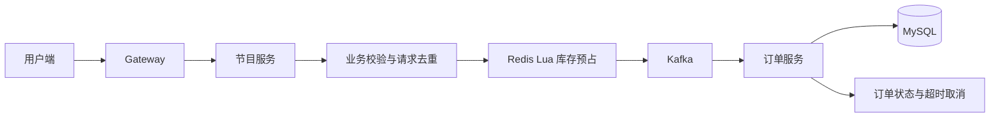
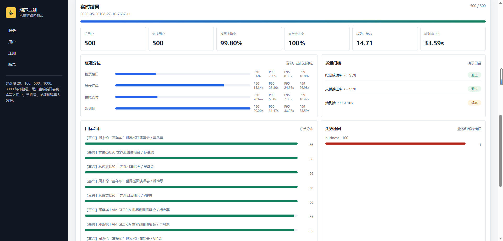

# 潮声票务 Tides

面向演出与电影购票场景的 Java 微服务项目，包含用户端、后台管理端、后端业务服务及抢票模拟工具。

**Spring Boot · Spring Cloud Alibaba · MySQL · Redis · Kafka · Vue 3**

[核心链路](#核心链路) · [代码导航](#代码导航) · [运行准备](#运行准备) · [压测说明](#压测说明) · [配套 AI 助手](https://github.com/19continue/tides-ai)

项目开始于 2025.11。主要业务包括节目与电影浏览、场次和票档查询、选座购票、订单创建、支付及后台运营。

## 项目预览

<table>
  <tr>
    <td></td>
    <td></td>
  </tr>
</table>

<details>
<summary>展开更多界面截图</summary>


</details>

## 核心链路

以 V4 异步购票路径为阅读入口：请求经过业务校验与重复提交控制，在 Redis 中完成库存和座位处理，再通过 Kafka 交给订单服务落库。发送失败、消费异常与超时取消分别有对应处理入口。



返回订单号与订单最终落库属于不同阶段。不同版本的购票策略保留在代码中，阅读时需要沿具体版本跟踪执行路径。

## 代码导航

| 关注点 | 入口 | 阅读内容 |
| --- | --- | --- |
| 购票入口 | [ProgramOrderController](tides-server/tides-program-service/src/main/java/com/tides/controller/ProgramOrderController.java) | 各版本接口及策略分发 |
| V4 策略 | [ProgramOrderV4Strategy](tides-server/tides-program-service/src/main/java/com/tides/service/strategy/impl/ProgramOrderV4Strategy.java) | 参数校验、重复提交控制与下单调用 |
| 库存与异步下单 | [ProgramOrderService](tides-server/tides-program-service/src/main/java/com/tides/service/ProgramOrderService.java) | 库存预占、发送消息、失败处理 |
| 库存脚本 | [programDataCreateOrderResolution.lua](tides-server/tides-program-service/src/main/resources/lua/programDataCreateOrderResolution.lua) | 同一次 Redis 脚本中的库存和座位操作 |
| 订单消费 | [CreateOrderConsumer](tides-server/tides-order-service/src/main/java/com/tides/service/kafka/CreateOrderConsumer.java) | 消息消费、延迟判断与异常记录 |
| 订单落库 | [OrderService](tides-server/tides-order-service/src/main/java/com/tides/service/OrderService.java) | 订单创建及业务状态处理 |
| 超时取消 | [DelayOrderCancelConsumer](tides-server/tides-order-service/src/main/java/com/tides/service/delayconsumer/DelayOrderCancelConsumer.java) | 超时订单处理 |
| 本地缓存 | [LocalCacheProgram](tides-server/tides-program-service/src/main/java/com/tides/service/cache/local/LocalCacheProgram.java) | 节目信息缓存 |
| 模拟验证 | [抢票模拟器说明](tools/ticket-rush-simulator/README.md) | 请求配置、事件记录与结果报告 |

## 仓库结构

```text
tides-server/                     后端业务服务
tides-server-client/              DTO、VO 与 Feign 接口
tides-common/                     公共模型、枚举和工具
tides-spring-cloud-framework/     Spring Cloud 基础封装
tides-redis-tool-framework/       Redis 工具
tides-redisson-framework/         Redisson 封装
tides-elasticsearch-framework/    搜索能力
tides-manage-front/               后台管理前端
vue3/                            用户端前端
sql/                             数据库脚本
tools/ticket-rush-simulator/      抢票模拟工具
```

## 运行准备

- JDK 17、Maven；前端使用 Node.js 20+，管理端使用 pnpm 10+。
- 准备 MySQL、Redis、Kafka、Nacos 等依赖；按要运行的服务补齐搜索、支付等配置。
- 按所选环境核对数据库脚本、服务配置和外部依赖。下面是构建入口，完整运行仍需要配套服务与配置。

后端构建：

```bash
mvn -DskipTests clean package
```

该命令跳过测试，仅用于构建，不代表测试已通过。

后台管理端：

```bash
cd tides-manage-front
pnpm install
pnpm run dev:ele
```

用户端：

```bash
cd vue3
npm install
npm run dev
```

实际依赖版本见 [pom.xml](pom.xml)。本地凭据和生产参数通过本地配置或环境变量管理。

## 压测说明

仓库保留了一次 500 个模拟用户请求三场热门演唱会的历史结果截图。该记录采用每人一次抢票、失败后不重试的场景，不能直接换算为系统 QPS 或生产容量。



[抢票模拟器](tools/ticket-rush-simulator/README.md)提供配置示例与事件报告。复测时应同时记录机器配置、代码版本、请求入口、并发方式、测试时长、成功订单数、失败原因和延迟分位数。工具中的模拟支付用于演示环境，不能证明真实支付渠道的处理能力。

## 相关项目

[Tides AI](https://github.com/19continue/tides-ai) 为票务场景提供业务咨询、规则问答与运维信息查询。
