# tides

`tides` 是一个面向电影、演出票务与后台管理场景的微服务项目，包含后端服务、前端管理台、前端用户端、公共组件、数据库脚本和工具脚本。

> 项目开始时间：2025.11

## 项目截图
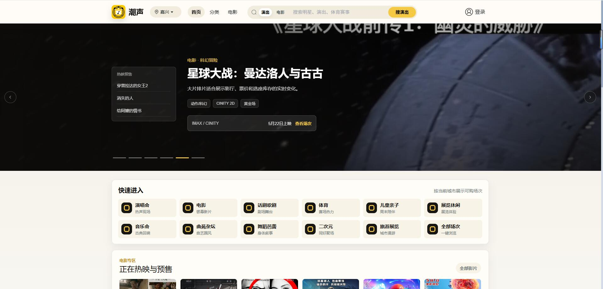

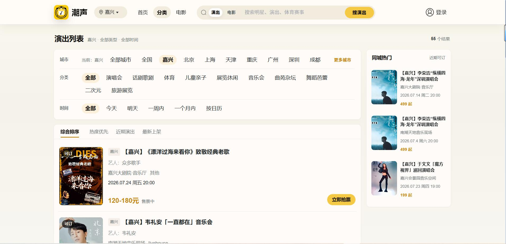
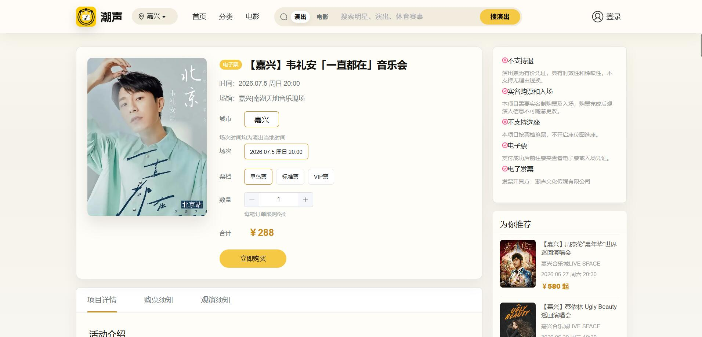

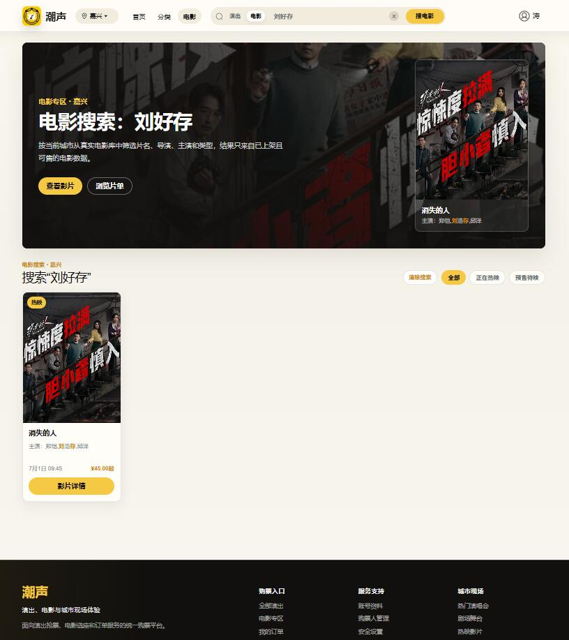
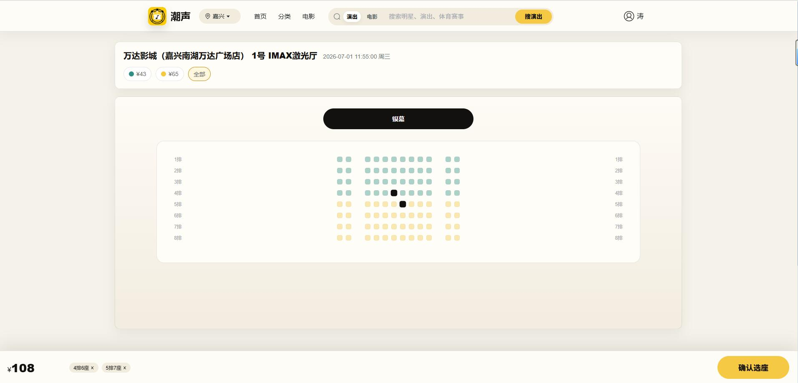
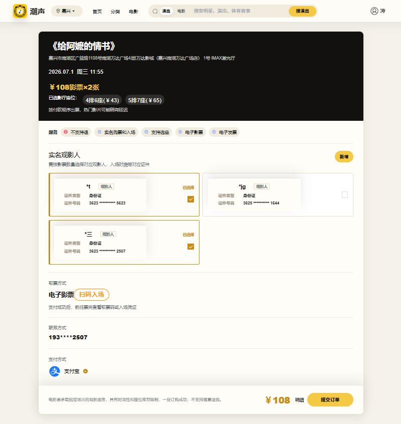
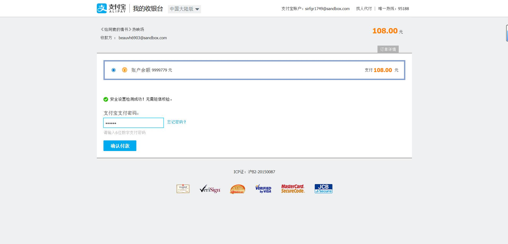
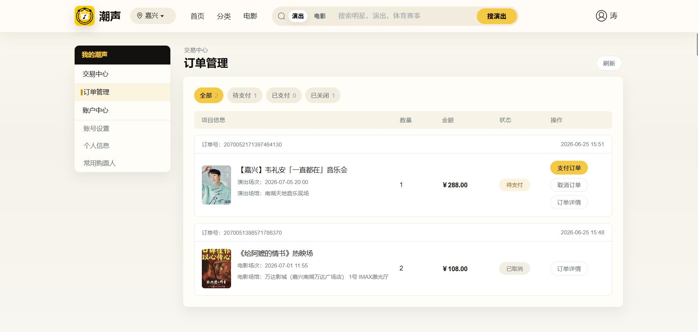
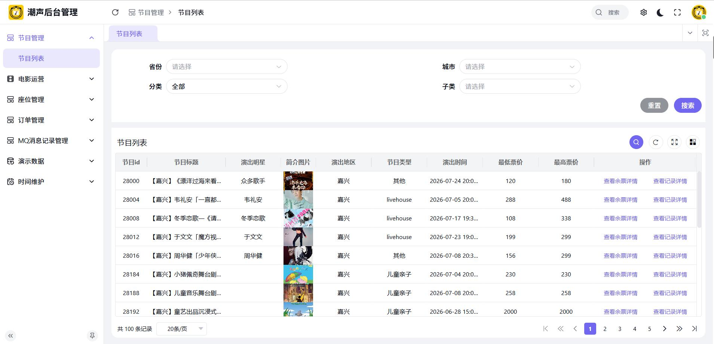
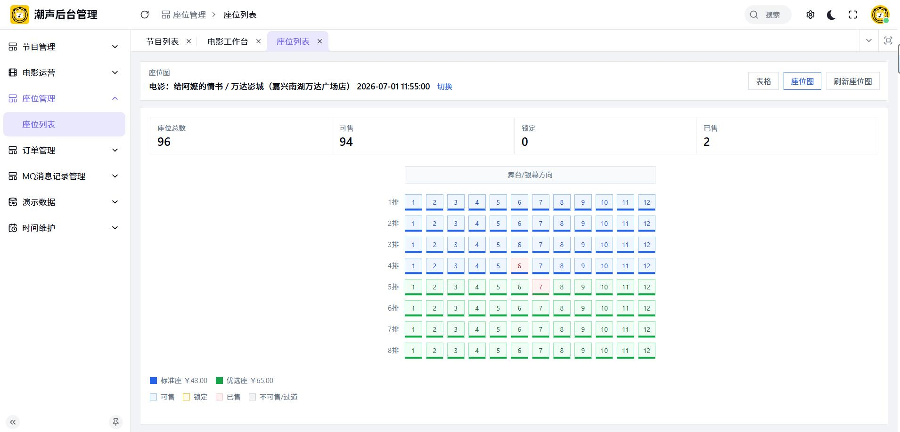
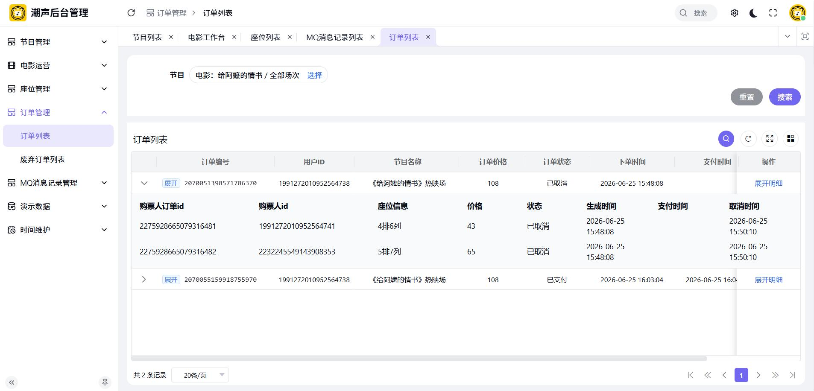
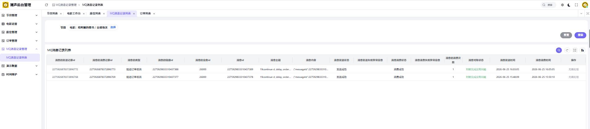

## 目录
- `tides-server`：后端业务服务
- `tides-server-client`：服务间 DTO / VO / Feign 定义
- `tides-common`：公共模型、枚举和工具
- `tides-spring-cloud-framework`：Spring Cloud 基础封装
- `tides-redis-tool-framework`、`tides-redisson-framework`、`tides-elasticsearch-framework`、`tides-id-generator-framework`、`tides-thread-pool-framework`：基础能力模块
- `tides-captcha-manage-framework`：验证码能力
- `tides-manage-front`：后台管理前端
- `vue3`：用户端前端
- `sql`：初始化和业务 SQL
- `tools`：辅助工具

## 技术栈
Spring Boot 3.3、Spring Cloud Alibaba、MyBatis-Plus、Redis、Redisson、Vue 3、Vite、Element Plus、pnpm

## 环境要求
- JDK 17
- Node.js 20+
- pnpm 10+（`tides-manage-front`）
- npm 或 pnpm（`vue3`）

## 启动方式

### 后端
```bash
mvn -DskipTests clean package
```

### 后台前端
```bash
cd tides-manage-front
pnpm install
pnpm run dev:ele
```

### 用户端
```bash
cd vue3
npm install
npm run dev
```

## 配置说明
- 敏感配置不入库，仓库内提供 `.env.example`
- 生产参数和密钥请在本地单独维护
